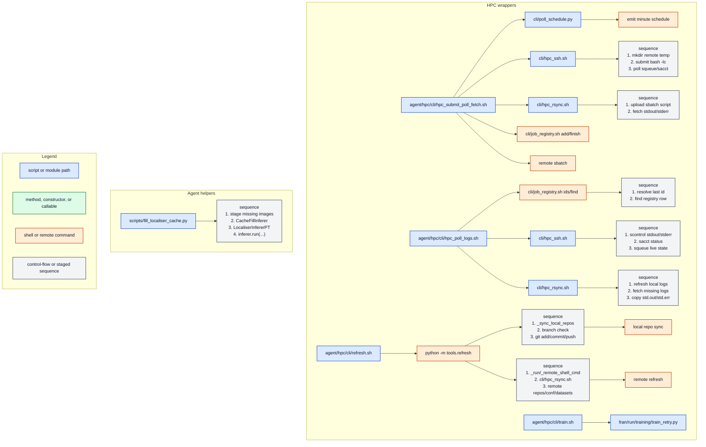

# Agent Call Graph

Sample rule: agent-centered slice from the shared CLI sample; immediate edges only, with deeper HPC helper paths.

| Entry | Purpose | Immediate Calls |
| --- | --- | --- |
| `agent/hpc/cli/hpc_submit_poll_fetch.sh` | Submit, poll, fetch logs | `cli/poll_schedule.py`, `cli/hpc_ssh.sh`, `cli/hpc_rsync.sh`, `cli/job_registry.sh add/finish`, `remote sbatch` |
| `agent/hpc/cli/hpc_poll_logs.sh` | Resolve job, refresh, fetch logs | `cli/job_registry.sh ids/find`, `cli/hpc_ssh.sh`, `cli/hpc_rsync.sh` |
| `agent/hpc/cli/refresh.sh` | Refresh local and remote HPC state | `python -m tools.refresh`, `_sync_local_repos`, `git add/commit/push`, `_run/_remote_shell_cmd`, `cli/hpc_rsync.sh` |
| `agent/hpc/cli/train.sh` | Slurm wrapper for FRAN training | `fran/run/training/train_retry.py` |
| `scripts/fill_localiser_cache.py` | Backfill missing localiser cache JSONs | `stage missing images`, `CacheFillInferer`, `LocaliserInfererPT`, `inferer.run(...)` |

## Notes

- HPC paths are taken one layer deeper than the rest of the sample.
- Sequence boxes enumerate ordered direct calls from one owner node.
- Cross-repo leaves stay compact when they point into FRAN.
