# FRAN Call Graph

Sample rule: FRAN-centered slice from the shared CLI sample; immediate edges only, with sequence boxes for ordered manager flow.

| Entry | Purpose | Immediate Calls |
| --- | --- | --- |
| `fran/run/project/project.sh` | Thin project creation wrapper | `project_init.py` |
| `fran/run/project/project_init.py` | Create project and attach datasources | `DS.names()`, `Project(...)`, `Project.create(...)`, `Project.add_data(...)`, `Project.maybe_store_projectwide_properties(...)` |
| `fran/run/dataregistry/update_datasources.py` | Init or update datasource H5 state | `load_datasets()`, `Datasource(folder, name)`, `ds.update_datasource(...)` |
| `fran/run/preproc/analyze_resample.py` | Analyze, resample, emit mode datasets | `Project(...)`, `ConfigMaker(...)`, `confirm_plan_analyzed(...)`, `process_plan(args)`, `PreprocessingManager(args)`, `resample_dataset(...)`, `plan mode branch` |
| `fran/run/training/train_retry.py` | Retry training on CUDA OOM | `build train.py cmd`, `subprocess.Popen(...)`, `train.py`, `OOM marker check`, `reduced batch size retry` |

```mermaid
flowchart TD
  classDef file fill:#dbeafe,stroke:#1d4ed8,color:#0f172a,stroke-width:1.5px;
  classDef func fill:#dcfce7,stroke:#15803d,color:#0f172a,stroke-width:1.5px;
  classDef cmd fill:#ffedd5,stroke:#c2410c,color:#0f172a,stroke-width:1.5px;
  classDef step fill:#f3f4f6,stroke:#4b5563,color:#111827,stroke-width:1.5px;

  subgraph PROJECT[Project and data]
    F1["fran/run/project/project.sh"]:::file
    F1A["project_init.py"]:::file

    F1 --> F1A

    F2["fran/run/project/project_init.py"]:::file
    F2A["sequence<br/>1. DS.names()<br/>2. Project(project_title=...)<br/>3. Project.create(...)<br/>4. Project.add_data(...)<br/>5. Project.maybe_store_projectwide_properties(...)"]:::func

    F2 --> F2A

    F3["fran/run/dataregistry/update_datasources.py"]:::file
    F3A["sequence<br/>1. load_datasets()<br/>2. Datasource(folder, name)<br/>3. ds.update_datasource(...)"]:::func

    F3 --> F3A

  end

  subgraph PREPROC[Preproc]
    F4["fran/run/preproc/analyze_resample.py"]:::file
    F4A["sequence<br/>1. Project(...)<br/>2. ConfigMaker(...)<br/>3. confirm_plan_analyzed(...)<br/>4. process_plan(args)"]:::func
    F4B["sequence<br/>1. PreprocessingManager(args)<br/>2. resample_dataset(...)<br/>3. select plan mode"]:::step
    F4C["patch/pbd<br/>1. generate_hires_patches_dataset(...)"]:::step
    F4D["lbd<br/>1. generate_lbd_dataset(...)"]:::step
    F4E["imported lbd<br/>1. generate_TSlabelboundeddataset(...)"]:::step
    F4F["rbd<br/>1. generate_rbd_dataset(...)"]:::step
    F4G["whole<br/>1. generate_whole_images_dataset(...)"]:::step

    F4 --> F4A
    F4A --> F4B
    F4B --> F4C
    F4B --> F4D
    F4B --> F4E
    F4B --> F4F
    F4B --> F4G

  end

  subgraph TRAIN[Training]
    T1["fran/run/training/train_retry.py"]:::file
    T1A["sequence<br/>1. build train.py cmd<br/>2. run subprocess<br/>3. collect combined output"]:::step
    T1C["sequence<br/>1. inspect OOM markers<br/>2. reduce batch size<br/>3. next attempt"]:::step
    T1B["agent/hpc/cli/train.sh"]:::file

    T1 --> T1A
    T1A --> T1C
    T1B --> T1

  end

  subgraph LEGEND[Legend]
    L1["script or module path"]:::file
    L2["method, constructor, or callable"]:::func
    L3["shell or remote command"]:::cmd
    L4["control-flow or staged sequence"]:::step
  end
```

## Notes

- This view stays near the current depth except for analyze_resample.py and train_retry.py.
- Sequence boxes enumerate ordered direct calls from one owner node.
- Cross-repo leaves stay compact when they point back into agent wrappers.
